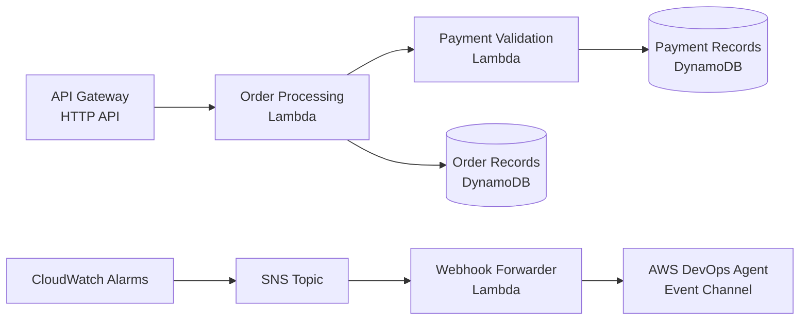

# AWS DevOps Agent — Live Incident Investigation Demo

> **⚠️ Important:** This sample is provided for demonstration and educational purposes only and is not intended for production use without additional security review and testing.

This sample application demonstrates [AWS DevOps Agent](https://docs.aws.amazon.com/devopsagent/latest/userguide/) investigating real AWS infrastructure incidents autonomously. Deploy a serverless order processing service, inject failures, and watch the agent perform root cause analysis in real time.

## Architecture



## Demo Scenarios

| Scenario | What It Simulates | Root Cause |
|----------|-------------------|------------|
| **Throttling** | Lambda concurrency limit misconfigured | Reserved concurrency set to 1 |
| **Cascading Failure** | Upstream service degrades under load | Payment service throttled by DynamoDB capacity |
| **Code Bug** | Application error on write path | KeyError in order processing logic |
| **Infrastructure Issue** | Timeout from config change | Lambda timeout reduced to 1 second |

## Prerequisites

- AWS Account with [AWS DevOps Agent](https://docs.aws.amazon.com/devopsagent/latest/userguide/getting-started.html) enabled
- [AWS SAM CLI](https://docs.aws.amazon.com/serverless-application-model/latest/developerguide/install-sam-cli.html) installed
- [AWS CLI](https://docs.aws.amazon.com/cli/latest/userguide/getting-started-install.html) configured with appropriate credentials
- Python 3.12+

## Quick Start

### 1. Deploy the Application

```bash
cd demo-app
sam build --template-file infra/lambda-template.yaml
sam deploy --stack-name devops-agent-demo \
  --resolve-s3 \
  --capabilities CAPABILITY_IAM CAPABILITY_AUTO_EXPAND \
  --region us-east-1
```

### 2. Configure DevOps Agent

1. Create an [Agent Space](https://docs.aws.amazon.com/devopsagent/latest/userguide/agent-spaces.html) in the AWS Console
2. Associate your AWS account
3. Create an Event Channel and note the webhook URL and secret
4. Update the webhook configuration:

```bash
# Set your webhook URL and secret as environment variables
export WEBHOOK_URL="https://event-ai.<region>.api.aws/webhook/generic/<your-webhook-id>"
export WEBHOOK_SECRET="<your-webhook-secret>"

# Update the deployed Lambda
aws lambda update-function-configuration \
  --function-name alarm-webhook-forwarder \
  --environment "Variables={WEBHOOK_URL=${WEBHOOK_URL},WEBHOOK_SECRET=${WEBHOOK_SECRET}}" \
  --region us-east-1
```

### 3. Verify Deployment

```bash
# Get API URL
API_URL=$(aws cloudformation describe-stacks --stack-name devops-agent-demo \
  --query 'Stacks[0].Outputs[?OutputKey==`ApiUrl`].OutputValue' --output text --region us-east-1)

# Health check
curl ${API_URL}/health

# Place a test order
curl -X POST ${API_URL}/orders \
  -H "Content-Type: application/json" \
  -d '{"customer_id":"test","product_name":"Widget","quantity":1,"unit_price":9.99,"shipping_address":"123 Main St"}'
```

### 4. Run a Demo Scenario

```bash
# Inject throttling (sets Lambda concurrency to 1)
bash scripts/inject-throttling.sh

# Send alert to DevOps Agent
python3 scripts/simulate_webhook.py --scenario throttling

# Watch the investigation in the DevOps Agent console!

# Reset when done
bash scripts/reset.sh
```

## Project Structure

```
demo-app/
├── app/                          # Application code
│   ├── lambda_handler.py         # Lambda entry point (order service)
│   ├── payment_handler.py        # Payment validation Lambda
│   ├── alarm_forwarder.py        # SNS → DevOps Agent webhook forwarder
│   ├── config.py                 # Configuration
│   ├── models/                   # Data models
│   ├── routes/                   # API route handlers
│   └── services/                 # Business logic
├── buggy/                        # Faulty code variants for injection
├── dashboard/                    # Browser-based monitoring dashboard
├── docs/                         # Presentation materials and guides
├── infra/                        # SAM/CloudFormation templates
│   └── lambda-template.yaml      # Primary deployment template
├── scripts/                      # Injection and utility scripts
│   ├── inject-throttling.sh      # Scenario: Lambda throttling
│   ├── inject-cascading-failure.sh # Scenario: Cross-service failure
│   ├── inject-code-bug.sh        # Scenario: Application error
│   ├── inject-infra-issue.sh     # Scenario: Config misconfiguration
│   ├── simulate_webhook.py       # Send test alerts to DevOps Agent
│   ├── reset.sh                  # Restore healthy state
│   └── load_generator.py         # Generate concurrent traffic
├── webhook/                      # Alert payload templates
└── requirements.txt
```

## How It Works

### Alert Flow

1. **Injection script** introduces a fault (e.g., reduces Lambda concurrency to 1)
2. **Load generator** sends concurrent requests that trigger failures
3. **CloudWatch Alarm** detects error rate exceeding threshold
4. **SNS Topic** receives the alarm notification
5. **Webhook Forwarder Lambda** signs and forwards to DevOps Agent Event Channel
6. **DevOps Agent** automatically investigates — querying CloudWatch metrics, Lambda logs, and CloudTrail

### What DevOps Agent Investigates

The agent autonomously:
- Checks CloudWatch metrics (invocations, errors, throttles, duration)
- Reads Lambda function logs for error patterns
- Queries CloudTrail for recent configuration changes
- Correlates timelines across services
- Identifies root cause and recommends remediation

## Dashboard

Open `dashboard/index.html` in a browser for a real-time monitoring view:
- Service health status
- Order success/failure rates
- Burst test (concurrent request simulation)
- Activity log with response codes

The dashboard connects to your deployed API Gateway endpoint.

## Cleanup

```bash
sam delete --stack-name devops-agent-demo --region us-east-1
```

## Cost

Estimates based on us-east-1 pricing as of June 2026, assuming minimal demo traffic (< 100 requests/day).

| Resource | Estimated Cost |
|----------|---------------|
| Lambda (3 functions) | ~$0.50/day during active demo |
| DynamoDB (2 tables, on-demand + provisioned) | ~$0.15/day |
| API Gateway (HTTP API) | ~$0.01/day |
| CloudWatch Logs | ~$0.10/day |
| DevOps Agent | Free with Enterprise Support credits |
| **Total (idle)** | **< $1/day** |

## Security

See [CONTRIBUTING](CONTRIBUTING.md#security-issue-notifications) for more information.

## License

This library is licensed under the MIT-0 License. See the [LICENSE](LICENSE) file.
