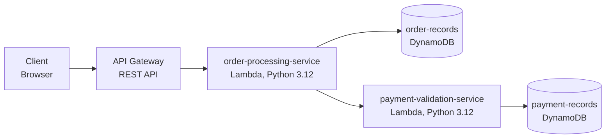

# AWS DevOps Agent Demo Deck

---

## Slide 1: Title

**AWS DevOps Agent: Watch AI Investigate a Live Incident**

Live Demo & Q&A

---

## Slide 2: The Problem

**When production breaks at 2am...**

- Engineers spend 30-60 minutes correlating logs, checking deployments, tracing through code
- Microservice architectures make it worse — the alert fires on Service A, but the root cause is in Service B
- Mean Time to Resolution (MTTR) is dominated by investigation, not the fix itself

**What if an AI agent could do that investigation autonomously?**

---

## Slide 3: What is AWS DevOps Agent?

- Receives alerts from your monitoring tools (PagerDuty, Datadog, CloudWatch)
- Autonomously investigates using your existing AWS infrastructure
- Traces across service boundaries using logs, metrics, and CloudTrail
- Surfaces root cause and recommends fixes — no human intervention needed

**Integration:** Webhook from monitoring tool → Agent investigates → Root cause in minutes

---

## Slide 4: Our Demo Application

**Order Processing Service**

A production-like microservice that processes customer orders:

- Validates payment via an upstream service
- Persists orders to DynamoDB
- Exposes REST API via API Gateway

| Component | Purpose |
|-----------|---------|
| API Gateway | Public REST endpoint |
| order-processing-service (Lambda) | Handles order CRUD |
| payment-validation-service (Lambda) | Validates payment before order creation |
| order-records (DynamoDB) | Stores orders |
| payment-records (DynamoDB) | Stores payment validations |

---

## Slide 5: Architecture Diagram



---

## Slide 6: Request Flow (Healthy)

1. Client sends `POST /orders` to API Gateway
2. **order-processing-service** receives the request
3. Calls **payment-validation-service** synchronously (Lambda invoke)
4. Payment service writes to **payment-records** DynamoDB
5. Payment returns `"approved"` → order persisted to **order-records**
6. Client receives HTTP 201 with order details

**Key:** The order service depends on the payment service. If payment fails, orders fail.

---

## Slide 7: Monitoring & Observability

| Layer | What we have |
|-------|-------------|
| **Structured Logs** | JSON logs with `request_id`, `upstream_function` fields for cross-service correlation |
| **CloudWatch Alarms** | Error rate, latency, DynamoDB throttling |
| **CloudTrail** | All API calls (config changes, deployments) |
| **Service Mapping** | JSON runbook defining service dependencies |
| **Dashboard** | Real-time health visualization |

The DevOps Agent uses ALL of these during investigation.

---

## Slide 8: The Scenario — Cascading Failure

**Story:** The platform team reduced the payment service's concurrency and timeout as a "cost optimization."

- Reserved concurrency → 1 (only one request at a time)
- Timeout → 2 seconds

**Result:**
- Single requests: ✅ still work
- Concurrent traffic: ❌ payment service throttled → orders fail
- Health check: ✅ still passes (GET /health doesn't call payment service)

**This is invisible to tests and health checks. It only breaks under real traffic.**

---

## Slide 9: The Challenge

The alert fires on the **order-processing-service**:

> "POST /orders timeouts under concurrent load"

But the root cause is in the **payment-validation-service** configuration.

**The agent must:**
1. Start at the order service (where symptoms are)
2. Find the upstream dependency
3. Trace to the payment service
4. Discover the configuration change
5. Identify it as the root cause

---

## Slide 10: Live Demo

**Watch the agent investigate in real-time.**

```bash
# 1. Inject the failure
bash demo-app/scripts/inject-cascading-failure.sh

# 2. Trigger the investigation
python3 demo-app/scripts/simulate_webhook.py --scenario cascading-failure

# 3. Watch the agent work...

# 4. Reset
bash demo-app/scripts/reset.sh
```

---

## Slide 11: What the Agent Found

**Root cause:** `PutFunctionConcurrency` set payment-validation-service to 1

**Investigation path:**
1. ✅ Checked order-processing-service logs → found `PaymentValidationError`
2. ✅ Noticed `upstream_function: "payment-validation-service"`
3. ✅ Traced to payment-validation-service via service mapping
4. ✅ Found `TooManyRequestsException` (throttling)
5. ✅ Checked Lambda config → concurrency=1, timeout=2s
6. ✅ CloudTrail → identified who made the change and when

**Time to root cause: ~3 minutes** (vs 30-60 minutes manually)

---

## Slide 12: Key Takeaways

1. **Autonomous investigation** — from alert to root cause, no human clicking through consoles
2. **Cross-service tracing** — follows the evidence across service boundaries
3. **Uses your existing infrastructure** — CloudWatch, CloudTrail, Lambda. Nothing new to install.
4. **Finds what tests miss** — config issues that only manifest under production traffic
5. **Identifies who and when** — CloudTrail correlation for accountability

---

## Slide 13: Getting Started

- **Integration:** Webhook from your monitoring tool (PagerDuty, Datadog, CloudWatch)
- **Setup:** Connect your AWS account, configure service mappings
- **Pricing:** 2-month free trial, then per-investigation pricing
- **Supported:** Lambda, ECS, EKS, EC2 — anything that emits to CloudWatch

---

## Slide 14: Q&A

| Question | Answer |
|----------|--------|
| Datadog/PagerDuty integration? | Native webhook + MCP integrations |
| Does it fix things? | Read-only investigation. Recommends fixes. |
| Multi-account? | Cross-account via IAM roles |
| How long do investigations take? | 2-5 minutes typically |
| Code repo access? | GitHub, GitLab, Azure DevOps integrations |

---
